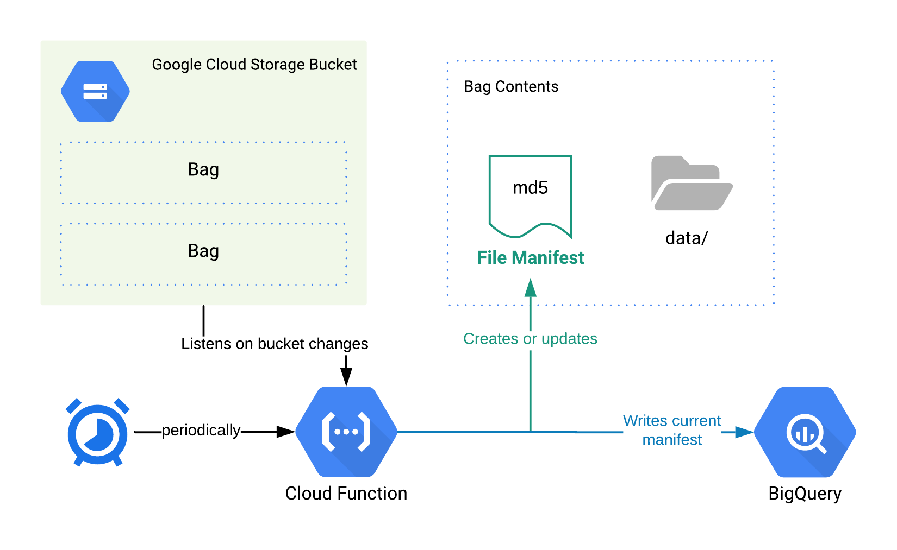

# Fixity Metadata for GCS 🗃
This script pulls metadata and checksums for file archives in Google Cloud Storage and stores them in a manifest file and in BigQuery to track changes over time. The script uses the [BagIt](https://tools.ietf.org/html/rfc8493) specification.

## Overview
Each time this Fixity function is run for any file archive bag using the BagIt specification, the following is created:
* An MD5 checksum manifest file
* Records in BigQuery containing the following metadata: bucket, bag, file name, file size, checksum, file modified date, fixity run date.

### Buckets
This Fixity function is configured for 1 Google Cloud Storage bucket containing any number of Bags.

### Bags
Bags should be created using the [BagIt Specification (RFC 8493)](https://tools.ietf.org/html/rfc8493). A Bag is a directory in a GCS bucket that contains a `data/` directory containing archived files. 

Any number of bags can be created in a GCS bucket, **as long as each bag contains a `data/` directory**. In the following example, this function will recognize 4 bags: `collection-europe/italy/`, `collection-europe/france/`, `collection-na/1700s/`, and `uncategorized/`.
```
BUCKET: Rare Books
.
├── collection-europe
│   ├── italy
│   │   └── data
│   │       ├── book1
│   │       ├── book2
│   │       └── book3
│   └── france
│       └── data
│           ├── book1
│           └── book2
├── collection-na
│   └── 1700s
│       └── data
│           ├── book1
│           ├── book2
│           └── book3
└── uncategorized
    └── data
        └── a
```

## Process


* Google Cloud Function listens on changes to a GCS Bucket (file archives, file updates)
* (or) Google Cloud Scheduler invokes Cloud Function manually or via a predefined schedule
* Function reads metadata of files for each Bag* that has file updates and writes a new Manifest file into each Bag
* Function writes records into BigQuery for each Bag with new metadata

_* If function is invoked by listening to changes on a GCS bucket, then Fixity is run only for the Bag that had the change. If function is invoked by Cloud Scheduler, then Fixity is run for the entire GCS Bucket_

## Setup
First, set your project by using `gcloud config set project <my-project>`
Set the following environment variables:
```
export PROJECT_ID=<my-project-id>
export BUCKET_NAME=<my-target-bucket-name>
```

### GCS Bucket Setup
1. [Create a GCS bucket](https://cloud.google.com/storage/docs/creating-buckets#storage-create-bucket-gsutil) that will contain your file archive bag(s).
```
gsutil mb gs://$BUCKET_NAME
```
2. Turn on [file versioning](https://cloud.google.com/storage/docs/object-versioning) for your GCS bucket to ensure files are never overwritten.
```
gsutil versioning set on gs://$BUCKET_NAME
```
3. Upload files using the structure into the `data/` directories created for each Bag. Note: It's a good idea to bulk upload files _before_ deploying/invoking the Fixity script, since each file upload will trigger a script invokation for each uploaded file if the script is deployed first.
```
gsutil cp * gs://$BUCKET_NAME/<bag_path>/data/
```
If you know the MD5 of a file before uploading you can specify it in the Content-MD5 header, which will cause the cloud storage service to reject the upload if the MD5 doesn't match the value computed by the service. See more [here](https://cloud.google.com/storage/docs/gsutil/commands/cp#checksum-validation)

### BigQuery Setup
This should be run *once*.

Run `make prepare` script creates the following resources:

* `fixity_data` and `fixity` datasets.
* `fixity_data.records` table to hold each individual Fixity record for every invokation.
* `fixity.current_manifest` view to show the current manifest of files for a bag.
* `fixity.file_operations` view to show all operations and diffs across time for a bag.

### Cloud Function Setup
The following commands should be run *once for each bucket* ensuring PROJECT_ID, and BUCKET_NAME are already set.

Ensure `BUCKET_NAME` is set to your bucket name using `export BUCKET_NAME=<bucket-name>`.
Run `make deploy`, which will deploy the Cloud Functions required for the operation:

* `track-deletes`: Runs Fixity check any time a file is archived.
* `track-updates`: Runs Fixity check any time a file is created or changed.
* `manual`: Enables Fixity runs that can be scheduled or invoked manually.

### Scheduler Setup
To create a schedule, use the following command. The default recommended below will run on the 1st of every month at 8:00 am.

Once the following has been created, you can run Fixity on demand by visiting https://console.cloud.google.com/cloudscheduler.
```
export SCHEDULE="1 of month 08:00"
gcloud scheduler jobs create pubsub fixity-${BUCKET_NAME} --schedule="${SCHEDULE}" --topic=fixity-${BUCKET_NAME}-topic --message-body={} 
```
